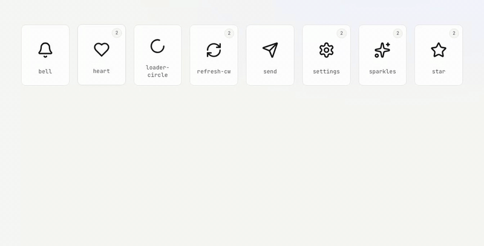
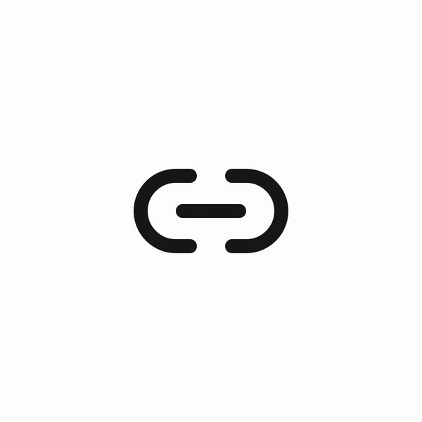

# @respeak/lucide-motion-vue

[](https://www.npmjs.com/package/@respeak/lucide-motion-vue)
[](https://www.npmjs.com/package/@respeak/lucide-motion-vue)
[](https://bundlephobia.com/package/@respeak/lucide-motion-vue)
[](https://vuejs.org)
[](https://www.npmjs.com/package/@respeak/lucide-motion-vue)

**516 animated Lucide icons for Vue 3** — drop-in, tree-shakeable, TypeScript-first. A library *and* a docs site: live demos, a searchable gallery, and a playground (coming next) to tweak any icon and copy the snippet.

[](https://respeak-io.github.io/lucide-motion-vue/)

**▶︎ [Live gallery + docs](https://respeak-io.github.io/lucide-motion-vue/)** — hover any icon to preview; click for variants, props, and copy-paste snippets. Built on [Motion for Vue](https://motion.dev/docs/vue), with icon variants ported from [animate-ui](https://github.com/imskyleen/animate-ui) and [lucide-animated / pqoqubbw/icons](https://github.com/pqoqubbw/icons).

- **516 icons**, tree-shakable, one chunk per icon
- Ergonomic triggers: `animateOnHover`, `animateOnTap`, `animateOnView`, or a composable `<AnimateIcon>` wrapper
- Composition API, `<script setup>`, full TypeScript types
- Native Motion loops — no hand-rolled rAF, no timers
- Color via `currentColor`, plays nicely with Tailwind / Vuetify / any design system
- Works standalone (`<Heart animateOnHover />`) or composed (`<AnimateIcon>` over anything)

## Contents

- [Install](#install)
- [Usage](#usage)
  - [Collision-safe names](#collision-safe-names)
  - [Per-icon subpath imports](#per-icon-subpath-imports)
- [Nuxt module](#nuxt-module)
- [Props](#props)
- [Styling](#styling)
- [`<AnimateIcon>` wrapper](#animateicon-wrapper)
- [Discovering variants (`iconsMeta`)](#discovering-variants-iconsmeta)
- [TypeScript](#typescript)
- [Accessibility](#accessibility)
- [Docs site](#docs-site)
- [Changelog](./CHANGELOG.md)
- [Contributing / regenerating icons](#contributing--regenerating-icons)
- [License](#license)

## Install

```bash
pnpm add @respeak/lucide-motion-vue motion-v
```

Peer deps: `vue ^3.3`, `motion-v ^2`.

## Usage

```vue
<script setup lang="ts">
import {
  AnimateIcon,
  Heart,
  BetweenVerticalStart,
} from '@respeak/lucide-motion-vue'
</script>

<template>
  <!-- Standalone, self-wrapped -->
  <Heart animateOnHover />
  <BetweenVerticalStart animateOnTap />

  <!-- Named animation variant -->
  <Heart animateOnHover animation="fill" />

  <!-- Composed: one trigger, many children -->
  <AnimateIcon animateOnHover>
    <span>
      <BetweenVerticalStart />
      <Heart />
    </span>
  </AnimateIcon>

  <!-- Button-as-trigger (renderless, via scoped slot) -->
  <AnimateIcon animateOnHover as="template" v-slot="{ on }">
    <v-btn color="primary" v-on="on">
      <BetweenVerticalStart :size="20" class="mr-2" />
      Align columns
    </v-btn>
  </AnimateIcon>
</template>
```

### Collision-safe names

If you use this library alongside `lucide-vue-next` (static icons), both export `Heart`. Use the `*Animated` alias to disambiguate:

```ts
import { Heart as StaticHeart } from 'lucide-vue-next'
import { HeartAnimated } from '@respeak/lucide-motion-vue'
```

### Per-icon subpath imports

Every icon is also exposed under `/icons/<kebab-name>` for consumers who want guaranteed separate chunks (or whose bundler trips on large barrel files):

```ts
import Heart from '@respeak/lucide-motion-vue/icons/heart'
import BetweenVerticalStart from '@respeak/lucide-motion-vue/icons/between-vertical-start'
```

Tree-shaking works with either import style (package is ESM + `"sideEffects": false`).

## Nuxt module

For Nuxt 3 apps the package ships a module at `@respeak/lucide-motion-vue/nuxt` that auto-registers `<AnimateIcon>` and every icon — no imports needed in your templates.

```ts
// nuxt.config.ts
export default defineNuxtConfig({
  modules: ['@respeak/lucide-motion-vue/nuxt'],
})
```

```vue
<!-- any .vue file, no imports needed -->
<HeartAnimated animateOnHover />
<Link2Animated animateOnTap animation="unlink" />
<AnimateIcon animateOnHover as="template" v-slot="{ on }">
  <button v-on="on">
    <HeartAnimated :size="20" /> Favorite
  </button>
</AnimateIcon>
```

The default naming is **suffixed** (`<HeartAnimated>`, `<StarAnimated>`, …) so the module coexists with `lucide-vue-next`'s static `<Heart>`, `<Star>` without collision — keep both installed and pick per-usage. Override the scheme in `nuxt.config` if you want something shorter:

```ts
export default defineNuxtConfig({
  modules: ['@respeak/lucide-motion-vue/nuxt'],
  lucideMotion: { prefix: 'M', suffix: '' },  // → <MHeart>, <MLink2>
})
```

Per-icon tree-shaking is preserved — templates that only reference `<HeartAnimated>` ship one chunk, not the whole library.

## Props

Every icon accepts:

| prop                  | type                     | default  | description                                                   |
|-----------------------|--------------------------|----------|---------------------------------------------------------------|
| `size`                | `number`                 | `28`     | Rendered width/height in px.                                  |
| `strokeWidth`         | `number`                 | `2`      | SVG stroke width.                                             |
| `animate`             | `boolean \| string`      | `false`  | Programmatic trigger. Pass a variant name to select it.       |
| `animateOnHover`      | `boolean \| string`      | `false`  | Play while hovered.                                           |
| `animateOnTap`        | `boolean \| string`      | `false`  | Play while pointer is down.                                   |
| `animateOnView`       | `boolean \| string`      | `false`  | Play when the icon enters the viewport.                       |
| `animation`           | `string`                 | `default`| Which named variant group to pull from (e.g. `fill`).         |
| `persistOnAnimateEnd` | `boolean`                | `false`  | Keep final state instead of returning to `initial`.           |
| `initialOnAnimateEnd` | `boolean`                | `false`  | Force snap to `initial` when animation ends.                  |
| `clip`                | `boolean`                | `false`  | Clip the icon's overflow at its bounding box — see below.     |
| `triggerTarget`       | `'self' \| 'parent' \| \`closest:${string}\`` | `'self'` | Bind hover/tap to an ancestor — see [Migrating existing buttons](#migrating-existing-buttons-triggertarget). |

Available `animation` names are icon-specific and mirror upstream animate-ui — e.g. `Heart` supports `default` and `fill`, `BetweenVerticalStart` supports `default` and `default-loop`, `Link2` supports `default`/`apart`/`unlink`/`link`. See [Discovering variants](#discovering-variants-iconsmeta) for a programmatic way to list them, or browse the docs site in `docs/` (`pnpm docs:dev`).

A few animations deliberately move parts of the icon outside its viewBox — `send`'s plane flies off before returning; `rocket`'s launch variant lifts off and out. Those read correctly only when the overflow is hidden, so they disappear on exit instead of touring around the rest of the page. That's what `clip` is for:

```vue
<SendAnimated animateOnHover clip />
<Rocket animateOnView clip animation="launch" />
```

Off by default because other icons (e.g. `link-2`'s burst particles) are designed to render outside their box and would break with clipping on.

<p align="center">
  
  <br />
  <sub><code>Link2</code> alone ships five variants — <code>default</code>, <code>apart</code>, <code>unlink</code>, <code>unlink-loop</code>, <code>link</code>.</sub>
</p>

Icons that are conceptually infinite (`LoaderCircle`, `Loader`, `LoaderPinwheel`, etc.) bake `repeat: Infinity` into their own variant transitions, so they loop as soon as you trigger them — no prop required. One-shot icons play once per trigger.

## Styling

Icons use `stroke="currentColor"` (and `fill: 'currentColor'` for fill-based variants), so color is driven by the parent's CSS `color` — same pattern as `lucide-vue-next`. Fill-based animations automatically pick up whatever color you set, so the tween stays on-brand.

```vue
<!-- Any of these work, including fill animations -->
<Heart animateOnHover class="text-rose-500" />
<Heart animateOnHover animation="fill" style="color: #4f46e5" />
<div style="color: var(--my-brand)"><Heart animateOnHover /></div>
```

Width and height can come from the `size` prop *or* CSS. Utility classes (`w-6 h-6`, `size-8`), scoped styles, and inline `style` all land on the inner `<svg>` — whether the icon self-wraps (any trigger prop set) or not.

```vue
<Heart :size="40" />
<Heart animateOnHover class="w-10 h-10" />
<Heart animateOnHover style="width: 40px; height: 40px" />
```

## `<AnimateIcon>` wrapper

```ts
import { AnimateIcon } from '@respeak/lucide-motion-vue'
```

A thin wrapper that catches trigger events and propagates animation state (via `provide/inject`) to any icon nested inside. Use it when one trigger should drive multiple icons, or when the trigger element should be something other than the icon itself (button, card, link…).

### Props

All the trigger/animation props below also work directly on individual icons; the wrapper just lets you share them across a subtree.

| prop                  | type                | default   | description                                                |
|-----------------------|---------------------|-----------|------------------------------------------------------------|
| `animate`             | `boolean \| string` | `false`   | Programmatic trigger. Pass a variant name to select it.    |
| `animateOnHover`      | `boolean \| string` | `false`   | Play while hovered.                                        |
| `animateOnTap`        | `boolean \| string` | `false`   | Play while pointer is down.                                |
| `animateOnView`       | `boolean \| string` | `false`   | Play when the wrapper enters the viewport.                 |
| `animation`           | `string`            | `default` | Which named variant group to pull from.                    |
| `persistOnAnimateEnd` | `boolean`           | `false`   | Keep final state instead of returning to `initial`.        |
| `initialOnAnimateEnd` | `boolean`           | `false`   | Force snap to `initial` when animation ends.               |
| `clip`                | `boolean`           | `false`   | Clip overflow at the wrapper's box — for "exit" animations. |
| `as`                  | `'span' \| 'template'` | `'span'` | Rendering mode — see below.                              |
| `triggerTarget`       | `'self' \| 'parent' \| \`closest:${string}\`` | `'self'` | Bind hover/tap to an ancestor instead of the wrapper — see below. |

### Rendering modes

- **`as="span"`** (default): renders a plain `<span>` that catches the trigger events and exposes a `viewRef` for `animateOnView`. The `<span>` has `display: inline-flex` so it doesn't break flow layout.
- **`as="template"`**: renderless — exposes `{ on, viewRef }` via the default scoped slot so you can bind them to any element (e.g. a `<v-btn>`, `<a>`, `<button>`, whole card). Nothing extra in the DOM.

```vue
<!-- Span mode: icons become the visual trigger area -->
<AnimateIcon animateOnHover>
  <Heart :size="20" />
  <BetweenVerticalStart :size="20" />
</AnimateIcon>

<!-- Template mode: the button is the trigger -->
<AnimateIcon animateOnHover as="template" v-slot="{ on }">
  <button v-on="on" class="card">
    <Heart :size="20" />
    <span>Favorite</span>
  </button>
</AnimateIcon>
```

### Migrating existing buttons (`triggerTarget`)

If you already have `<button><Icon /></button>` markup and want hover to fire on the whole button, set `triggerTarget` on the icon itself — no wrapper, no markup refactor:

```vue
<!-- Drop-in: the existing button stays untouched. -->
<button class="btn">
  <Heart animateOnHover triggerTarget="parent" :size="18" />
  Favorite
</button>

<!-- Extra wrappers between icon and button? Climb with closest. -->
<button class="btn">
  <span class="flex gap-2">
    <Trash2 animateOnHover triggerTarget="closest:button" :size="18" />
    Delete
  </span>
</button>
```

Which one to reach for:

- **`triggerTarget="parent"` / `"closest:…"`** — best for *migrations* and single-icon buttons. Additive (two props), no markup change.
- **`as="template"`** — best when one trigger should drive *several* icons, or when the trigger isn't an ancestor of the icon.

`triggerTarget` applies in `as="span"` mode only. In `as="template"` mode you already pick the trigger element by binding `on`.

## Discovering variants (`iconsMeta`)

Every icon's kebab name, Pascal name, and full list of animation variants is exported as a plain array — handy for building custom pickers, auto-generated docs, or validation.

```ts
import { iconsMeta, type IconMeta } from '@respeak/lucide-motion-vue'

iconsMeta[0]
// → {
//     kebab: 'accessibility',
//     pascal: 'Accessibility',
//     animations: [{ name: 'default', source: 'animate-ui' }],
//   }

// Each variant carries its upstream `source` ('animate-ui' | 'lucide-animated'
// | 'hand-written') for attribution — see ATTRIBUTIONS.md.
iconsMeta.find(m => m.pascal === 'Heart')?.animations.map(a => a.name)
// → ['default', 'fill']
```

## TypeScript

First-class. The package ships `.d.ts` alongside every chunk:

- Every icon has typed props (`size`, `strokeWidth`, `animate`, `animateOnHover`, …).
- `AnimateIcon`'s props are typed the same way; `as` is a literal union.
- `IconTriggerProps` and `IconMeta` are exported for anyone building a wrapper or registry on top.
- No `any` in the public surface.

```ts
import type { IconTriggerProps, IconMeta } from '@respeak/lucide-motion-vue'
```

## Accessibility

Icons render as plain `<svg>` elements, so standard SVG a11y patterns apply:

- **Decorative** (next to text that already says the thing): add `aria-hidden="true"`.
- **Meaningful** (icon-only button, status indicator): label it via `aria-label` on the button/parent, or wrap in a `role="img"` element with an accessible name.

```vue
<button aria-label="Favorite this item">
  <Heart aria-hidden="true" animateOnHover />
</button>

<span role="img" aria-label="Loading">
  <LoaderCircle />
</span>
```

Animation is purely visual — it never changes the DOM structure or any `aria-*` state, so screen readers aren't affected by it. Respect `prefers-reduced-motion` by wrapping in a parent that toggles the icon out when the user prefers reduced motion, or falls back to `lucide-vue-next` for those users.

## Docs site

**Live:** https://respeak-io.github.io/lucide-motion-vue/

Two views:

- **Browse icons** (`/`) — searchable grid, variant picker, copy-paste snippets.
- **Read the docs** (`/#/docs`) — usage patterns with live demos: icons in buttons, variants, color, programmatic triggers, and a section for AI agents pointing at `llms.txt`.

To run locally:

```bash
pnpm docs:dev       # serve it on http://localhost:5174
pnpm docs:build     # emit static site to docs-dist/
```

Set `VITE_DOCS_BASE=/repo-name/` when building for a GitHub Pages subpath deploy.

### For AI agents

A concise machine-readable API reference is served at `/llms.txt` (and checked into `docs/public/llms.txt`). Point your agent's system prompt or repo rules at it — see the docs site's "For AI agents" section for a drop-in Cursor rule and prompt template.

## Contributing / regenerating icons

The icons in `src/icons/` are generated from two upstream registries:

```bash
node scripts/port-icons.mjs --force            # animate-ui variants
node scripts/port-pqoqubbw-icons.mjs --force   # lucide-animated / pqoqubbw variants
```

Each script clones its upstream into `/tmp/…-upstream` on first run (shallow), then for every icon:

1. Extracts the module prelude (module-level constants, helper Variants, spring configs).
2. Extracts the `const animations = {…}` block.
3. Extracts the `IconComponent` return JSX and rewrites it to a Vue template.
4. Emits `src/icons/<kebab>.vue` using the standard SFC shape.
5. Regenerates `src/index.ts` with `Name` + `NameAnimated` exports.

When upstream adds a new icon, re-run the script — it auto-picks up new directories. Generated files are overwritten on re-run when `--force` is passed; without `--force` they're left alone.

Hand-written files (see below) are **always** preserved, even with `--force`, as long as their header comment contains the sentinel string `Hand-written` or `Hand-ported` — that's how the script tells a deliberate in-repo icon apart from an accidental edit to a generated file.

### Adding a hand-written icon

Drop a `.vue` file in `src/icons/` matching the pattern of the existing generated files (script + scoped slot + self-wrap branch + `motion.svg` with `:variants=` bindings). Include `// Hand-written` (or `// Hand-ported`) in the header comment so the port scripts know to skip it on re-run. `pnpm build` picks it up via the icon-entry glob in `vite.config.ts`, and re-running the codemod regenerates the barrel to include it.

If upstream later ships its own variant of an icon you've already written by hand (e.g. `rocket` gained a `lucide-animated` variant after the initial port), add it as an **additional** variant inside the same SFC and append a new row to the icon's `animations` array in `src/icons-meta.ts` with the correct `source`. Don't rename or remove the hand-written variants — cross-source icons are how this is supposed to look.

To do that splice with less guesswork, run:

```bash
node scripts/port-pqoqubbw-icons.mjs --augment=<kebab> [--variant-name=<name>]
```

It parses the upstream `.tsx` and your existing hand-written `.vue`, matches upstream paths to your `pathN` binding keys by comparing `d` attributes (fuzzy on the first 12 chars — small decimal tweaks survive), and prints a ready-to-paste variant block plus the `icons-meta.ts` row addition. The script never writes to the hand-written file — the paste is still a human decision. Default variant name is `lucide-animated`; override with `--variant-name=...` if that would collide with an existing key.

## License & attributions

MIT for the framework code in `src/core/`.

Icon variants come from several upstream projects — each variant in `iconsMeta` carries a `source` tag for attribution:

- **`animate-ui`** — [github.com/imskyleen/animate-ui](https://github.com/imskyleen/animate-ui) (MIT + Commons Clause). Roughly half of the icon variants.
- **`lucide-animated`** — [lucide-animated.com](https://lucide-animated.com), ported from [pqoqubbw/icons](https://github.com/pqoqubbw/icons) (MIT). The other large chunk.
- **`hand-written`** — designed in-repo (e.g. `rocket`).

Underlying SVG paths come from [Lucide](https://lucide.dev) (ISC).

See [`ATTRIBUTIONS.md`](./ATTRIBUTIONS.md) for the readable version and [`LICENSE`](./LICENSE) for the full legal text.
